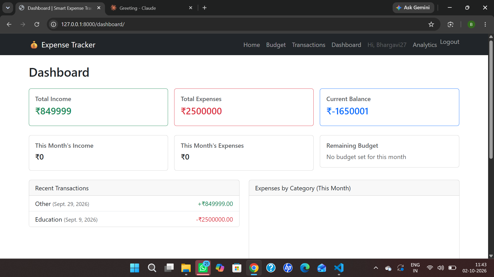
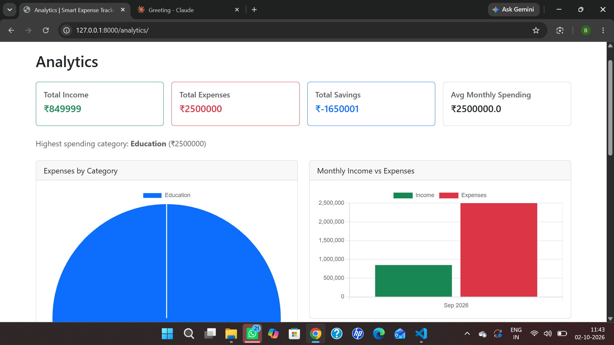
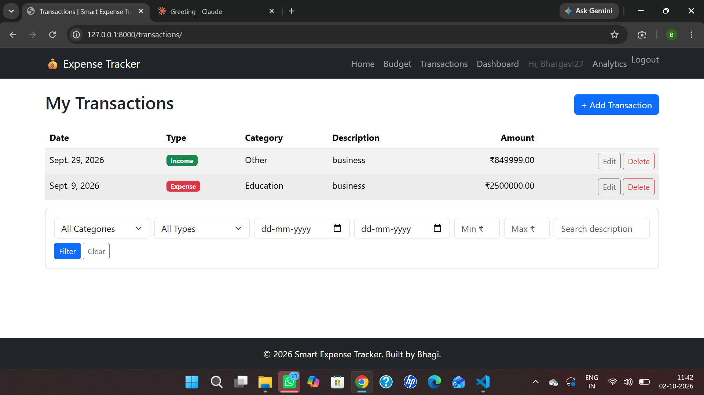

# Smart Expense Tracker & Analytics

A full-stack web application for tracking personal income and expenses, visualizing spending patterns, and managing monthly budgets — built with Django and Django REST Framework.

## Features

- **User Authentication** — secure registration, login, logout, with each user's data fully isolated from others
- **Dashboard** — real-time summary of income, expenses, balance, current-month totals, and remaining budget
- **Transaction Management** — add, edit, delete, and filter income/expense entries by category, type, date range, amount range, and description search
- **Budget Management** — set a monthly budget and track remaining balance with over-budget warnings
- **Analytics** — category breakdown, monthly income vs. expenses, and spending trend, visualized with Chart.js
- **REST API** — full CRUD access to transactions, categories, and budgets via Django REST Framework, scoped to the authenticated user
- **Django Admin** — custom list views, filters, and search across all models

## Technologies

- **Backend:** Python, Django 6, Django REST Framework
- **Frontend:** HTML5, CSS3, Bootstrap 5, JavaScript
- **Charts:** Chart.js
- **Database:** SQLite (development)
- **Auth:** Django's built-in authentication system
- **Version Control:** Git, GitHub

## Screenshots

| Dashboard | Analytics |
|---|---|
|  |  |

| Transactions | Admin |
|---|---|
|  |  |

## Installation

1. Clone the repository
```bash
   git clone https://github.com/bhargaviakurathi27/smart-expense-tracker.git
   cd smart-expense-tracker
```

2. Create and activate a virtual environment
```bash
   python -m venv venv
   venv\Scripts\activate      # Windows
   source venv/bin/activate   # macOS/Linux
```

3. Install dependencies
```bash
   pip install -r requirements.txt
```

4. Apply migrations
```bash
   python manage.py migrate
```

5. Seed default categories
```bash
   python manage.py seed_categories
```

6. Create a superuser (for admin access)
```bash
   python manage.py createsuperuser
```

7. Run the development server
```bash
   python manage.py runserver
```

8. Visit `http://127.0.0.1:8000/`

## Database

Uses SQLite by default for simple local development. Can be swapped for PostgreSQL or MySQL in production by updating `DATABASES` in `config/settings.py`.

**Models:**
- `Category` — name, type (income/expense)
- `Transaction` — user, category, amount, type, description, date
- `Budget` — user, month, year, amount (one per user per month)

## API Documentation

All endpoints require authentication (session-based).

| Method | Endpoint | Description |
|---|---|---|
| GET | `/api/transactions/` | List the authenticated user's transactions |
| POST | `/api/transactions/` | Create a transaction |
| GET | `/api/transactions/<id>/` | Retrieve one transaction |
| PUT/PATCH | `/api/transactions/<id>/` | Update a transaction |
| DELETE | `/api/transactions/<id>/` | Delete a transaction |
| GET | `/api/categories/` | List all categories |
| GET | `/api/budgets/` | List the authenticated user's budgets |
| POST | `/api/budgets/` | Create a budget |

## Future Improvements

- Export transactions to CSV/PDF
- Recurring transaction support
- Multi-currency support
- Email notifications when nearing budget limit
- Dark mode

## Author

Built by Bhargavi — [GitHub](https://github.com/bhargaviakurathi27)
